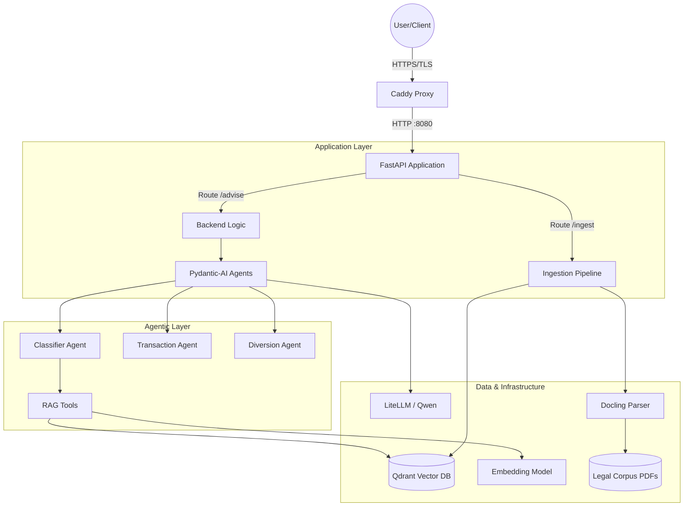
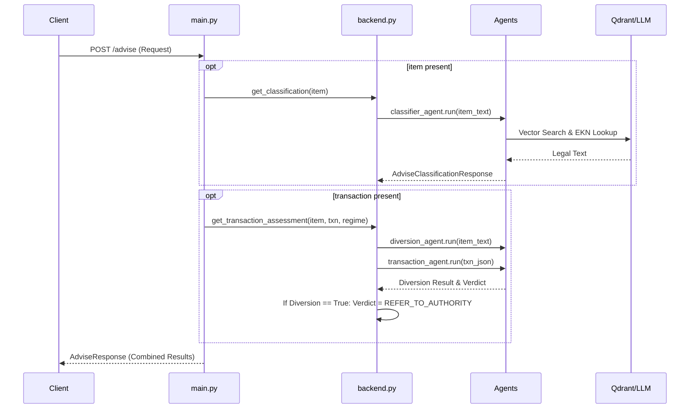

# Architecture: Export Control Advisor (Track 2)

This document describes the architecture of the Swiss export control advisor, a system designed to classify products against control lists, assess transaction licensing requirements, and screen counterparties for diversion risks.

## 1. System Overview

The application is a FastAPI-based microservice that provides an advisory interface for Swiss arms and dual-use export control law. It leverages a Retrieval-Augmented Generation (RAG) approach to ground its legal advice in a provided corpus of legislation and control lists.

### Tech Stack
- **API Framework**: FastAPI / Uvicorn
- **LLM Orchestration**: `pydantic-ai` (Agents, Tools, and Type-safe outputs)
- **Inference & Embeddings**: LiteLLM proxy providing OpenAI-compatible endpoints (Qwen models)
- **Vector Database**: Qdrant (Cosine similarity, payload filtering)
- **Document Parsing**: `docling` (PDF to JSON/Markdown)
- **Package Management**: `uv`
- **Deployment**: Docker Compose, Caddy (TLS termination), Nix (development shell)

---

## 2. High-Level Component Diagram

---

## 3. Request Lifecycle (`/advise`)

The `/advise` endpoint processes four optional blocks. The flow is coordinated in `app/src/app/main.py`.

---

## 4. Agent Layer

The system uses three specialized agents defined in `app/src/app/agents.py`.

| Agent | Responsibility | Output Type | Key Tools | Instructions Role |
| :--- | :--- | :--- | :--- | :--- |
| **Classifier** | Matches product description to legal entries | `AdviseClassificationResponse` | `search_ordinances`, `get_ekn_description` | Ground classification in semantic search and EKN lookups. |
| **Transaction** | Rules on licensing based on transaction details | `AdviseTransactionResponse` | None | Assess if a licence is required, prohibited, or not needed. |
| **Diversion** | Checks if parties are on the internal flagged list | `bool` | None | Binary check against a provided list of confidential entities. |

---

## 5. Retrieval Layer

The retrieval system is implemented in `app/src/app/tools.py` and `app/src/app/vector_db.py`.

- **Embeddings**: Uses `qwen3-embedding:8b` (4096-dim) via a remote API.
- **Vector Search**: `query_vector_db` performs a cosine similarity search on the `control_lists` collection, returning the top 20 most relevant passages.
- **EKN Lookup**: `get_ekn_description` uses Qdrant's `scroll` with a `FieldCondition` filter on the `EKN` payload key to retrieve the exact text of a specific Export Control Number.

---

## 6. Ingestion Pipeline

The ingestion process transforms raw PDFs into a searchable vector index.

**Dataflow**:
`PDF Corpus` $\rightarrow$ `docling` $\rightarrow$ `Page JSON` $\rightarrow$ `regex extraction` $\rightarrow$ `Embeddings` $\rightarrow$ `Qdrant`

1. **Parsing (`documents.py`)**: `docling` converts PDFs to structured JSON. Tables are exported to Markdown to preserve structure.
2. **Identification (`extract_identifiers.py`)**: A regex-based state machine identifies the start of legal entries (e.g., `0A001`). It handles continuation headers (e.g., `(Fortsetzung)`) to group multi-page entries into single logical blocks.
3. **Embedding**: Each extracted EKN entry is embedded as a single vector.
4. **Storage**: Vectors are upserted into Qdrant with payloads containing the filename, hash, EKN, and verbatim text.

---

## 7. Deployment & Configuration

### Topology
The system is deployed via `compose.yaml` with three services:
- **Proxy (Caddy)**: Terminates TLS and forwards traffic to the app.
- **App (FastAPI)**: The core advisor logic.
- **Qdrant**: The vector database for legal entries.

### Configuration
- **`config.py`**: Defines static settings (model names, vector size, default paths).
- **`inference.env`**: Contains sensitive API keys and base URLs for LiteLLM.
- **Volumes**: `/corpus` (read-only legal sources) and `/output` (parsed JSON cache).

---

## 8. Testing Strategy

- **Unit Tests**: `app/tests/` covers embedding logic, vector DB operations, and document parsing using `pytest`.
- **API Harness**: `scripts/test_api.py` validates the `/advise` endpoint against golden datasets:
    - `items`: Basic classification accuracy.
    - `full`: Full transaction advice (200 cases in `test_advice_200.json`).
    - `injection`: Resistance to indirect prompt injection (18 cases in `test_advice_injection.json`).
- **Validation**: `scripts/validate_test_advice.py` ensures golden cases are internally consistent and grounded.

---

## 9. Known Gaps & Risks

| Area | Issue | Impact |
| :--- | :--- | :--- |
| **Logic Bug** | `is_diversion_risk` receives `item_text` instead of transaction party names in `backend.py:32`. | Diversion screening currently fails to detect flagged parties. |
| **Feature Gap** | `query` block in `AdviseRequest` is not implemented in `main.py`. | Free-text compliance questions return "not implemented". |
| **Feature Gap** | `documents` block (attacker-controlled) is ignored. | No context from counterparty paperwork is used; however, this currently prevents prompt injection. |
| **Agent Context** | `transaction_agent` has no retrieval tools and receives no classification regime context. | Licensing verdicts are based solely on LLM internal knowledge rather than RAG. |
| **Robustness** | `/ingest` route swallows all exceptions. | Ingestion failures are not reported to the caller. |
